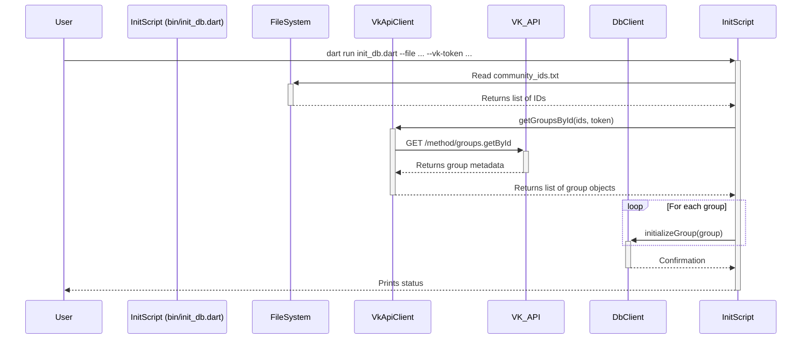
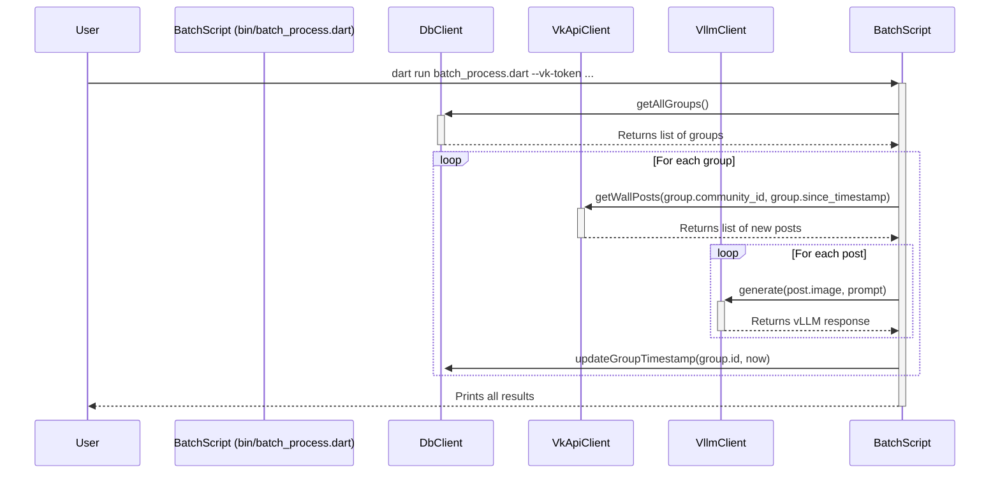

# Modification Design Document: Database Integration

## Overview

This document outlines the design for a significant modification to the `vllm_cli` tool. The goal is to add a persistent database using SQLite to store a list of VK communities. This will enable new batch processing capabilities. Two new scripts will be created: one to initialize the database from a text file of community IDs, and another to periodically fetch new posts from all communities in the database and process them with the vLLM.

## Problem Analysis

The current workflow requires manually specifying a single community ID. The user wants to automate this for multiple communities. This introduces several new requirements:

1.  **Persistence:** A mechanism is needed to store a list of target VK communities.
2.  **State Management:** For each community, we need to track the timestamp of the last processed post to avoid reprocessing old content. The `since_timestamp` field will serve this purpose.
3.  **Initialization:** A simple way to populate the database is required. A script that reads a list of community IDs from a text file and fetches their metadata (name, description) from the VK API is the most user-friendly approach.
4.  **Batch Processing:** A new master script is needed to iterate through all communities in the database, fetch new content for each, process it with the vLLM, and update the `since_timestamp` for that community.

## Alternatives Considered

### 1. Using a Plain Text or JSON File

-   **Description:** The list of communities and their `since_timestamp` could be stored in a structured text file like JSON or CSV.
-   **Pros:** Avoids adding a new database dependency.
-   **Cons:** This approach is not robust. Managing state by reading and writing to a text file is prone to race conditions and data corruption, especially if the script is interrupted. It is also less scalable and more complex to query or update individual records.
-   **Decision:** Using SQLite is a much more reliable and standard solution for managing structured, stateful data, even for a small-scale application like this. The `sqflite` package provides a mature and well-supported interface for this.

## Detailed Design

The modification will be centered around a new database layer, and two new executable scripts.

### 1. Database Layer (`lib/src/db_client.dart`)

-   A new `DbClient` class will be created to abstract all database operations.
-   It will use the `sqflite` package.
-   The database file will be named `vllm_cli.db` and stored in the project root.
-   **`initDB()` method:**
    -   Opens the database.
    -   Executes a `CREATE TABLE IF NOT EXISTS` statement for the `groups` table.
    -   The table schema will be:
        -   `id` INTEGER PRIMARY KEY AUTOINCREMENT
        -   `community_id` TEXT NOT NULL UNIQUE
        -   `name` TEXT NOT NULL
        -   `about` TEXT
        -   `since_timestamp` INTEGER NOT NULL
-   **`initializeGroup(...)` method:** Inserts a new group into the table. It will first check if a group with the given `community_id` already exists to prevent duplicates.
-   **`getAllGroups()` method:** Returns a `Future<List<Map<String, dynamic>>>` of all records in the `groups` table.
-   **`updateGroupTimestamp(int id, int newTimestamp)` method:** Updates the `since_timestamp` for a specific group by its primary key `id`.

### 2. VK API Client (`lib/src/vk_api_client.dart`)

-   The existing `VkApiClient` will be enhanced with a new method.
-   **`getGroupsById(List<String> groupIds, String accessToken)` method:**
    -   This method will call the `groups.getById` endpoint of the VK API.
    -   It will take a list of community IDs and the access token.
    -   It will request the `description` field to get the `about` text.
    -   It will return a list of group objects containing their `id`, `name`, and `description`.

### 3. Initialization Script (`bin/init_db.dart`)

-   A new command-line script.
-   **Arguments:**
    -   `--vk-token`: Required VK API access token.
    -   `--file`: Required path to a text file containing community IDs (one per line).
-   **Logic:**
    1.  Parse arguments.
    2.  Instantiate `DbClient` and call `initDB()`.
    3.  Instantiate `VkApiClient`.
    4.  Read the community IDs from the specified file.
    5.  Call `vkApiClient.getGroupsById` to fetch community metadata.
    6.  For each community returned by the API:
        -   Calculate a `since_timestamp` for two weeks ago.
        -   Call `dbClient.initializeGroup` to insert the new record.

### 4. Batch Processing Script (`bin/batch_process.dart`)

-   A new command-line script.
-   **Argument:**
    -   `--vk-token`: Required VK API access token.
-   **Logic:**
    1.  Instantiate `DbClient`, `VkApiClient`, and `VllmClient`.
    2.  Call `dbClient.getAllGroups()`.
    3.  Get the current Unix timestamp before starting the loop (`newTimestamp`).
    4.  Iterate through each `group` from the database.
    5.  Call `vkApiClient.getWallPosts` using the group's `community_id` and `since_timestamp`.
    6.  Process the returned posts using the same logic as in `vllm_cli_vk.dart` (extract text and image, call `vllmClient.generate`).
    7.  After successfully processing all posts for a group, call `dbClient.updateGroupTimestamp` with the group's `id` and the `newTimestamp` captured at the start.

### 5. Mermaid Diagrams

**Initialization Flow (`init_db.dart`)**

**Batch Processing Flow (`batch_process.dart`)**

## Summary

This modification introduces a robust, database-backed system for batch processing. It cleanly separates concerns by creating a dedicated database client (`DbClient`) and two new, single-purpose scripts (`init_db.dart` and `batch_process.dart`). The existing `VkApiClient` is extended to support fetching group metadata. This design is scalable and maintains a clear project structure.

## Research URLs

-   **sqflite package:** [https://pub.dev/packages/sqflite](https://pub.dev/packages/sqflite)
-   **VK API `groups.getById`:** [https://dev.vk.com/method/groups.getById](https://dev.vk.com/method/groups.getById)