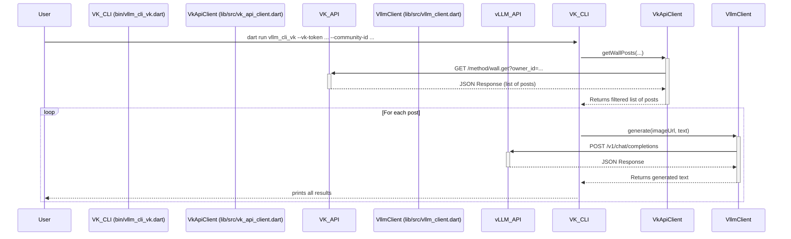

# Modification Design Document: VK Integration

## Overview

This document outlines the design for modifying the `vllm_cli` tool to support fetching content from a VK.com community wall. A new, separate command-line script will be created (`bin/vllm_cli_vk.dart`) that takes a VK community ID, an access token, and a timestamp, fetches relevant posts, and then uses the existing `VllmClient` to process them.

## Problem Analysis

The user wants to extend the functionality of the `vllm_cli` tool to use content from VK.com as a data source. The goal is to automate the process of feeding posts from a specific community into the vision-language model.

This requires a new workflow:
1.  **Data Ingestion:** Fetch posts from a VK community wall using the VK API.
2.  **Filtering:**
    -   Filter posts to include only those created by the community owner.
    -   Filter posts to include only those newer than a given timestamp.
3.  **Data Extraction:** For each post, extract the text and the URL of any attached images.
4.  **Processing:** For each post that contains both text and an image, use the existing `VllmClient` to send the data to the vLLM service.
5.  **Output:** Print the results to the console.

### New Command-Line Parameters

The new script will require the following arguments:
-   `--vk-token`: The VK API access token.
-   `--community-id`: The ID of the VK community (a negative integer).
-   `--since-timestamp`: A Unix timestamp to filter posts. Only posts newer than this will be processed.

## Alternatives Considered

### 1. Modifying the Existing Script with Subcommands

-   **Description:** Instead of a new script, the existing `bin/vllm_cli.dart` could be modified to use subcommands (e.g., `vllm_cli url ...` and `vllm_cli vk ...`).
-   **Pros:** Keeps all functionality within a single executable.
-   **Cons:** Adds complexity to the argument parsing logic. The two use cases (direct URL vs. VK scraping) are distinct enough that separating them into two scripts is cleaner and more maintainable for this initial implementation.
-   **Decision:** The user agreed to create a separate script, which is a simpler and more direct approach for this modification.

## Detailed Design

The modification will be implemented by adding two new main components: a VK API client and a new CLI entrypoint.

### 1. VK API Client (`lib/src/vk_api_client.dart`)

-   A new class, `VkApiClient`, will be created to handle all communication with the VK API.
-   **Constructor:** It will accept an `http.Client` for dependency injection and testing.
-   **`getWallPosts(...)` method:**
    -   This asynchronous method will take the `accessToken`, `communityId`, and `sinceTimestamp` as arguments.
    -   It will return a `Future<List<Map<String, dynamic>>>`.
    -   It will construct the URL for the `wall.get` method of the VK API.
        -   `https://api.vk.com/method/wall.get`
        -   Parameters:
            -   `owner_id`: The `communityId`.
            -   `access_token`: The `accessToken`.
            -   `v`: A recent API version (e.g., `5.199`).
            -   `filter`: Hardcoded to `owner`.
            -   `count`: Set to a reasonable number (e.g., 100) to fetch a batch of recent posts.
    -   It will make a GET request using the injected `http.Client`.
    -   It will handle non-200 responses by throwing an exception.
    -   It will parse the JSON response and extract the `items` array from `response['response']['items']`.
    -   It will filter these items in-memory, keeping only posts where the `date` field is greater than `sinceTimestamp`.
    -   It will return the filtered list of post objects.

### 2. New CLI Entrypoint (`bin/vllm_cli_vk.dart`)

-   This new script will orchestrate the entire process.
-   It will use `package:args` to parse the new command-line arguments (`--vk-token`, `--community-id`, `--since-timestamp`).
-   The `main` function will:
    1.  Validate that all required arguments are present.
    2.  Instantiate the `VkApiClient` and the `VllmClient`.
    3.  Call `vkApiClient.getWallPosts(...)` to fetch and filter the posts.
    4.  Iterate through the returned posts.
    5.  For each post:
        -   Extract the `text`.
        -   Check for attachments. Find the first attachment of type `photo`.
        -   If a photo is found, extract the URL of the largest available image size from the `sizes` array.
        -   If both text and an image URL are found, call `vllmClient.generate(imageUrl, text)`.
        -   Print the original post text, the image URL, and the response from the vLLM.
    6.  Include `try-catch` blocks for robust error handling.

### 3. Mermaid Diagram

## Summary

The design introduces a new, self-contained workflow for processing VK.com content while reusing the existing `VllmClient`. A new `VkApiClient` will encapsulate the logic for interacting with the VK API, and a new entrypoint script `vllm_cli_vk.dart` will handle the orchestration. This approach cleanly separates the new functionality from the existing code, promoting maintainability and making the system easy to test.

## Research URLs

-   **VK API `wall.get` method:** [https://dev.vk.com/method/wall.get](https://dev.vk.com/method/wall.get)
